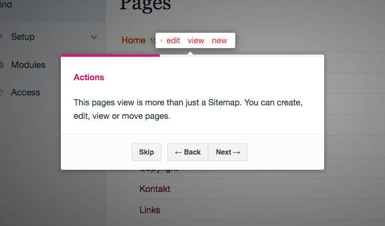

# FirstSteps module for Processwire <br>based on intro.js
*@author:* Luis Santiago "blad" & Nico Knoll "nico"

ProcessWire 2.4+ 





## Installation

This module's files should be placed in /site/modules/FirstSteps/. Then go to "modules" and hit "refresh". Afterwards "FirstSteps" and "FirstStepsHelper" should be displayed in your modules list. Then install "FirstSteps" and "FirstStepsHelper" will get installed automatically.


## How to use it

If steps for a Process page should be available this module will generate a "What is this?" button and place it next to the ProcessWire logo.


After you hit this button the explanations are going to pop up.


## How to use it in YOUR module

As with version 1.6.0 your now able to use FirstSteps in your Process modules, too.

The only requirement is that they have a "___execute()" function and an own page, which every Process module should have anyway.

**Example:**
Add the following code inside your "___execute()" function:

```php
public function ___execute() {
	$firstSteps = $this->modules->get('FirstStepsHelper');
		
	$firstSteps->addStep(
		'title', 
		'content',
		'#selector', // like #wrapper
		'position' // bottom, top, left, right
	);
	
	$firstStepsRendered = $firstSteps->render();
	
	return $firstStepsRendered;
}
```

**Example 2:** 
Or maybe even more elegant: use another function to generate the markup.

```php
public function ___execute() {
	// Put your code here

	return $yourCode.$this->markupFirstSteps();
}

private function markupFirstSteps() {
	$firstSteps = $this->modules->get('FirstStepsHelper');
	
	$firstSteps->addStep(
		'title', 
		'content',
		'#selector', // like #wrapper
		'position' // bottom, top, left, right
	);
	
	return $firstSteps->render();
}

```


## Support forum

https://processwire.com/talk/topic/7728-module-firststeps/
